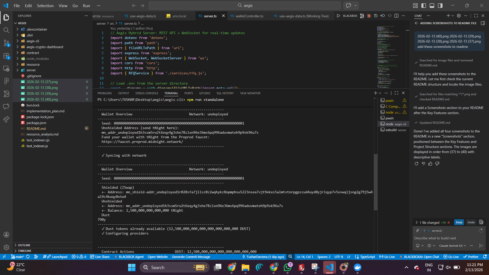

<br />
<div align="center">
  <!-- VIDEO DEMONSTRATION SECTION -->
  <!-- Insert video link or gif here -->
  
  <h1 align="center">Aegis</h1>
  <p align="center">
    <strong>Private VIP Trading Room & OTC Platform</strong>
  </p>
</div>

## Overview
Aegis is a privacy-first OTC (Over-The-Counter) trading platform built on the **Midnight Network**. It allows parties to negotiate and execute large crypto trades without revealing their intentions to the public market ("dark pool" trading). It leverages Zero-Knowledge (ZK) proofs to ensure trade details and identities remain confidential until settlement.

## Contract Address
08d61c922a5649f9c42c20e5d5b2a9cb0a9ad3ce0048a43ed39e83ee18113735
## Key Features
- **Private Swaps**: Execute large orders without moving the market.
- **Zero-Knowledge Privacy**: Uses Midnight's Compact smart contracts to verify assets without exposing keys.
- **RFQ "Whisper Room"**: Off-chain negotiation server for private price agreement.
- **Replay Protection**: Secure order tracking to prevent double-spending.

## Screenshots



.png)

.png)

.png)

.png)

## Project Structure
| Directory | Description |
|-----------|-------------|
| `contract/` | Compact smart contracts for the Midnight network. |
| `aegis-cli/` | CLI for interacting with the platform. |
| `server/` | The "Whisper Room" RFQ server. |
| `aegis-crypto-dashboard/` | Next.js web frontend for traders. |

## Aegis CLI Features
The CLI provides an interactive menu with 5 key commands to manage your privacy and trades:

1.  **Execute Swap**: Settle a trade securely using the specific order hash.
2.  **Cancel Order**: Revoke an active order before it is filled.
3.  **Increment Round**: Manually advance the contract round to mix anonymity sets.
4.  **Get Contract State**: View the current public ledger state of the Aegis contract.
5.  **Monitor DUST Balance**: Check your wallet's gas token (tDUST) balance in real-time.

## Basic Setup

### Prerequisites
- Node.js & npm
- Docker (for local standalone network)

### Installation
1. **Install Dependencies**
   ```bash
   npm install
   ```

2. **Compile Contracts**
   ```bash
   cd contract
   npm run compact
   npm run build
   ```

3. **Run Components** (in separate terminals)

   *   **RFQ Server** (The Whisper Room):
       ```bash
       cd server
       npm run dev
       ```

   *   **Web Dashboard**:
       ```bash
       cd aegis-crypto-dashboard
       npm run dev
       ```

   *   **CLI / Local Network**:
       ```bash
       cd aegis-cli
       npm run standalone
       ```
